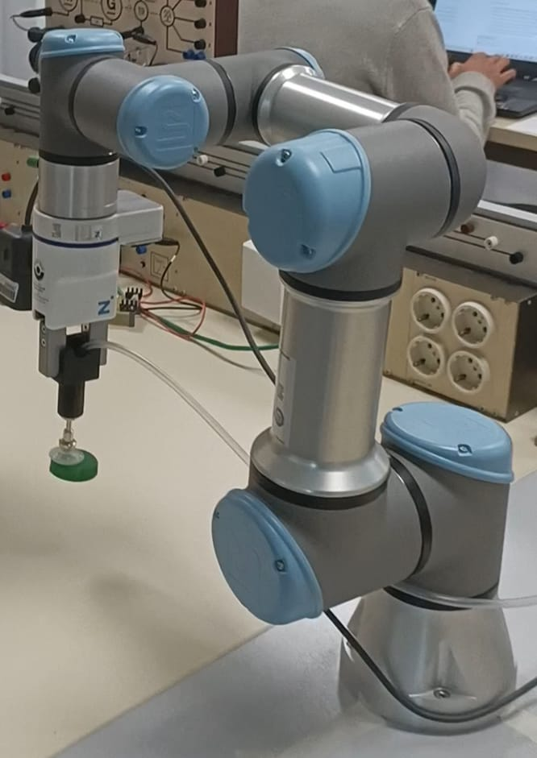

# ♻️ Recyclex: Clasificación Robótica de Tapones por Color

**Recyclex** es un sistema robótico inteligente desarrollado como parte del *Máster Universitario en Automática y Robótica*, cuyo objetivo es automatizar la clasificación de tapones plásticos por color para su reciclaje y reutilización como filamento en impresión 3D.  

Este sistema integra visión artificial, inteligencia artificial, algoritmos de decisión y control robótico mediante un robot colaborativo UR3.

---

## 🧠 Motivación

El reciclaje manual de tapones es ineficiente, especialmente cuando deben clasificarse por color. Este proyecto propone una solución automatizada que:

- Detecta tapones mediante visión artificial (YOLOv5).
- Clasifica por color usando lógica de decisión.
- Controla un brazo robótico UR3 para manipularlos.
- Deposita cada tapón en el contenedor correspondiente.

> 🌱 Recyclex contribuye a una economía circular y sostenible mediante la automatización del proceso de reciclaje.

---

## 🖼️ Visión General del Sistema


---

## ⚙️ Características Principales

- ✅ Detección de tapones con **YOLOv5**.
- 🎨 Clasificación por color con lógica de decisión basada en área.
- 🤖 Control de un robot **UR3** vía RTDE o TCP/IP.
- 🧲 Herramienta de agarre por **ventosa**.
- 🖥️ GUI en **PyQt5** para visualización y control.
- 🔁 Ciclo completo e **iterativo** de manipulación de tapones.

---

## 📂 Estructura del Proyecto

```bash
FinalCode/
│
├── main.py                       # Script principal
├── cameraControl.py              # Control y adquisición de imagen
├── capDetection.py              # Detección con YOLOv5
├── decisionMaker.py             # Selección del tapón óptimo
├── robotControl.py              # Control del UR3
├── gui.py                        # Interfaz gráfica (PyQt)
├── intrinsic_calibration_data.json  # Calibración de cámara
├── capDetectionsFile.json       # Resultados de detección
├── resources/                   # Recursos gráficos (GUI)
├── train3/                      # Modelo YOLO entrenado
├── assets/                      # Imágenes para documentación
└── requirements.txt             # Librerías necesarias
```

---

## 📸 Módulos Principales

### 🔍 Detección con YOLOv5

- Entrenado con imágenes de tapones.
- Precisión y rapidez para uso en tiempo real.

### 🧠 Algoritmo de Decisión

- Elige el tapón más accesible según área visible.
- Verifica si está en el rango manipulable del UR3.

### 🤖 Control del UR3

- Control por movimientos `MoveL`, `MoveJ` y `MoveS`.
- Comunicación mediante protocolo RTDE o TCP/IP.

### 🧲 Efector Final (Ventosa)

- Herramienta seleccionada tras pruebas de agarre.
- Adaptación a distintos tamaños de tapones.

### 🖥️ Interfaz Gráfica (GUI)

- Visualización en tiempo real del proceso.
- Registro de eventos, detecciones y estado del robot.

---

## 🛠️ Requisitos

- Python 3.10
- YOLOv5 (PyTorch)
- OpenCV, NumPy, PyQt5
- URControl vía RTDE / TCP/IP
- Cámara HD (ej. Intel RealSense)

---

## 🚀 Instalación

1. Clona o descomprime el proyecto:
   ```bash
   unzip FinalCode.zip
   cd FinalCode
   ```

2. Instala las dependencias:
   ```bash
   pip install -r requirements.txt
   ```

---

## ▶️ Ejecución

Para lanzar la aplicación completa:
```bash
python3 main.py
```
Esto abrirá la interfaz gráfica y comenzará el proceso automatizado de detección, clasificación y depósito.

---

## 🧩 Arquitectura por Módulos


Los módulos se desarrollaron según los *Work Packages (WP)* del proyecto académico:

- WP300 – Visión por computador
- WP400 – Algoritmo de decisión
- WP500 – Control del UR3
- WP600 – Planificación de movimientos
- WP700 – Integración
- WP800 – Validación

---

## 📈 Resultados Esperados

- ✔️ Precisión de detección > 90%
- ⏱️ Tiempo de ciclo por tapón < 5 s
- 🔁 Procesamiento iterativo continuo
- 🧩 Robustez ante variaciones de color/forma

---

## 👥 Equipo de Desarrollo

Este proyecto fue desarrollado como parte del *Laboratorio de Robótica y Automática*.

| Nombre               | Rol                                              |
|----------------------|--------------------------------------------------|
| Iñaki Dellibarda     | Algoritmo de decisión y planificación (WP400/600)|
| Diego Ramírez        | Visión por computador e integración (WP300/700)  |
| Pablo Hita           | Control del robot UR3 y gestión (WP500/100)      |
| Carlos Mesa          | Herramienta del UR y validación (WP200/800)      |

---

## 📦 Repositorio

Repositorio oficial del proyecto:
👉 [https://github.com/DiegoRamirezFuente/RecycleX.git](https://github.com/DiegoRamirezFuente/RecycleX.git)

---

## 🧪 Validación Final

Incluye:

- Pruebas funcionales en laboratorio
- Documentación técnica
- Vídeo divulgativo y vídeo técnico (ver en el repositorio)

---
