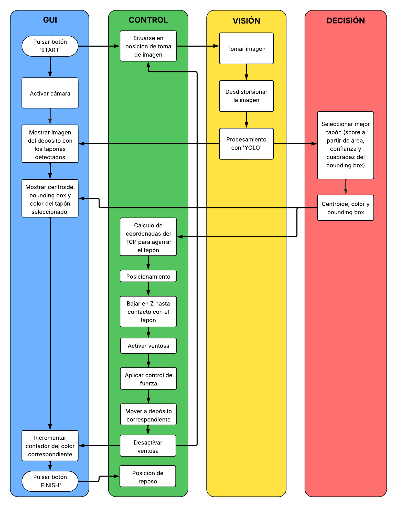
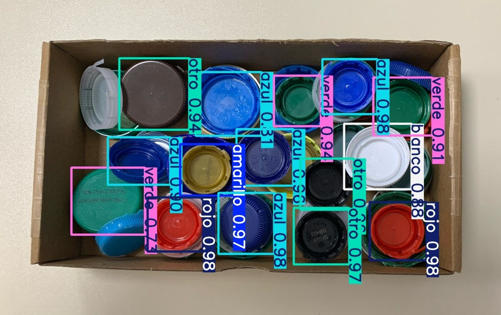
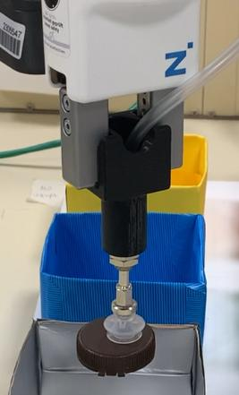
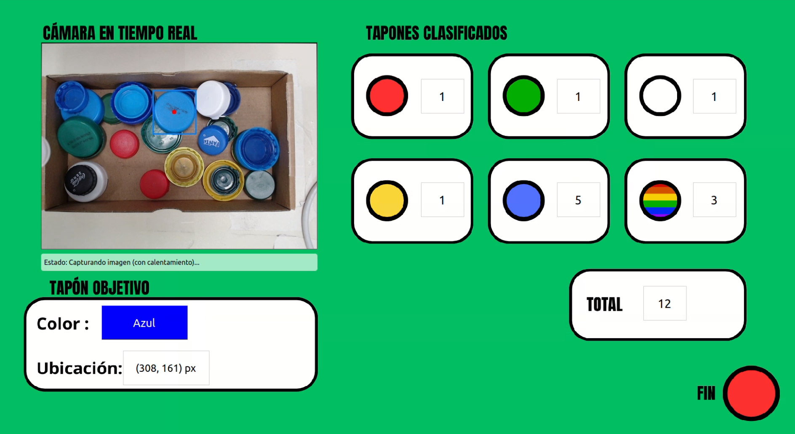

# ♻️ RecycleX: Clasificación Robótica de Tapones por Color

**RecycleX** es un sistema robótico inteligente desarrollado como parte del *Máster Universitario en Automática y Robótica*, cuyo objetivo es automatizar la clasificación de tapones plásticos por color para su reciclaje y reutilización como filamento en impresión 3D.  

Este sistema integra visión artificial, inteligencia artificial, algoritmos de decisión y control robótico mediante un robot colaborativo UR3.



---

## 🧠 Motivación

El reciclaje manual de tapones es ineficiente, especialmente cuando deben clasificarse por color. Este proyecto propone una solución automatizada que:

- Detecta tapones mediante visión artificial (YOLOv8).
- Clasifica por color usando lógica de decisión.
- Controla un brazo robótico UR3 para manipularlos.
- Deposita cada tapón en el contenedor correspondiente.

> 🌱 RecycleX contribuye a una economía circular y sostenible mediante la automatización del proceso de reciclaje.

---

## 🧩 Arquitectura por Módulos


---

## ⚙️ Características Principales

- 🎨 Detección de tapones y clasificación por color con **YOLOv8**.
- ✅ Lógica de decisión basada en área, confianza de detección y cuadratez del bounding box.
- 🤖 Control de un robot **UR3** vía RTDE o TCP/IP.
- 🧲 Herramienta de agarre por **ventosa**.
- 🖥️ GUI en **PyQt5** para visualización y control.
- 🔁 Ciclo completo e **iterativo** de manipulación de tapones.

---

## 📂 Estructura del Proyecto

```bash
RecycleX/
│
├── FinalCode/                          # Código principal del sistema
│   ├── main.py                         # Script principal
│   ├── cameraControl.py                # Control y adquisición de imagen
│   ├── capDetection.py                 # Detección con YOLOv8
│   ├── decisionMaker.py                # Selección del tapón óptimo
│   ├── robotControl.py                 # Control del UR3
│   ├── gui.py                          # Interfaz gráfica (PyQt)
│   ├── intrinsic_calibration_data.json # Calibración de cámara (copia)
│   ├── capDetectionsFile.json          # Resultados de detección
│   ├── resources/                      # Recursos gráficos para GUI
│   ├── train3/                         # Modelo YOLO entrenado
│   ├── assets/                         # Imágenes para documentación (README)
│   └── requirements.txt                # Librerías necesarias
│
├── CameraCalibration/                  # Scripts y datos para calibración
│   ├── 1_calibrate_intrinsics.py       # Calibración intrínseca de cámara
│   ├── calibracion_manual_yolo.py      # Calibración manual para YOLO
│   ├── calib_manual_hsv.py             # Calibración de color manual (HSV)
│   ├── evaluate_calib.py               # Evaluación global de calibración
│   ├── evaluate_intrinsic_stability.py # Prueba de estabilidad de la calibración
│   ├── calibracion_ur3.json            # Calibración extrínseca UR3-cámara
│   ├── intrinsic_calibration_data.json # Archivo de parámetros intrínsecos
│   ├── calib_images/                   # Imágenes usadas para calibrar
│   └── output/                         # Resultados y visualizaciones de calibración
```

---

## 📸 Módulos Principales

### 🔍 Detección con YOLOv8

- Entrenado con imágenes de tapones.
- Precisión y rapidez para uso en tiempo real.

### 🧠 Algoritmo de Decisión

- Elige el tapón más accesible según área visible.
- Verifica si está en el rango manipulable del UR3.

### 🤖 Control del UR3
- Comunicación mediante protocolo RTDE o TCP/IP.
- Control por movimientos `MoveL` y `MoveJ`.
- Movimiento hasta contacto mediante `MoveUntilContact`.
- Control de fuerza mediante `forceMode`.

### 🧲 Efector Final (Ventosa)

- Herramienta seleccionada tras pruebas de agarre.
- Adaptación a distintos tamaños de tapones.

### 🖥️ Interfaz Gráfica (GUI)

- Visualización en tiempo real del proceso.
- Registro de eventos, detecciones y estado del robot.

---

## 🛠️ Requisitos

- Python 3.10
- YOLOv8 (PyTorch)
- OpenCV, NumPy, PyQt5
- URControl vía RTDE / TCP/IP
- Cámara HD (ej. Intel RealSense)

---

## 🚀 Instalación

1. Clona el repositorio:
   ```bash
   git clone https://github.com/DiegoRamirezFuente/RecycleX.git
   ```

2. Instala las dependencias:
   ```bash
   pip install -r requirements.txt
   ```

---

## ▶️ Ejecución

Para lanzar la aplicación completa:
```bash
cd RecycleX/FinalCode
python3 main.py
```
Esto abrirá la interfaz gráfica y comenzará el proceso automatizado de detección, clasificación y depósito.

---

## 📈 Resultados Esperados

- ✔️ Precisión de agarre > 90%
- ⏱️ Tiempo de ciclo por tapón < 12 s
- 🔁 Procesamiento iterativo continuo
- 🧩 Robustez ante variaciones de color/forma

---

## 👥 Equipo de Desarrollo

Este proyecto fue desarrollado como parte de la asignatura *Laboratorio de Robótica y Automática* del Máster Universitario en Automática y Robótica de la *Universidad Politécnica de Madrid*.

| Integrantes             |
|-------------------------|
| Iñaki Dellibarda Varela |
| Pablo Hita Pérez        |
| Carlos Mesa Sierra      |
| Diego Ramírez Fuente    |
---

## 🎥 Vídeos del Proyecto

- 📽️ **Vídeo técnico**  
  Explica la arquitectura del sistema, calibración de cámara y robot, integración de módulos y funcionamiento interno del sistema completo.  
  👉 [Ver vídeo técnico en YouTube](https://www.youtube.com/watch?v=Oh661WRXyLc)

- 🌟 **Vídeo promocional y de demostración**  
  Muestra el sistema en funcionamiento clasificando tapones, con énfasis en su utilidad práctica, impacto ecológico y potencial de automatización.  
  👉 [Ver vídeo demostrativo en YouTube](https://www.youtube.com/watch?v=3DejUVXnluY)

---

